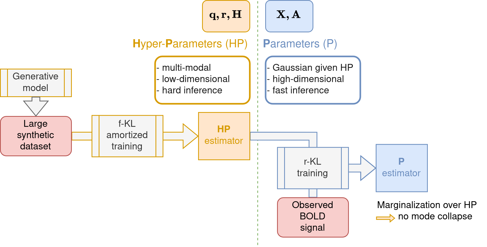

# Multivariate Dynamical System Identification (MDSI)

A Pytorch + [Pyro](https://pyro.ai/) implementation.

Methods graphical summary:


MDS generative model:
$$
\begin{equation}
\begin{aligned}
    Y &= \left[ y[1] \ ... \  y[T] \right] \\
    y[t] &= (H \ast X)[t] + \bm{\eta} \\
    \bm{\eta} &\sim \mathcal{N}(\mathbf{0}, r) \\
    H &= \begin{bmatrix}
        \cos (\alpha_1) & \sin (\alpha_1) \\
            \vdots & \vdots \\
        \cos (\alpha_M) & \sin (\alpha_M)
    \end{bmatrix} \times \begin{bmatrix}
        \mathbf{hrf} \\
        \dot{\mathbf{hrf}}
    \end{bmatrix}\\
    X &= \left[ x[1] \ ... \  x[T] \right] \\
    x[t+1] &= A[t] ~ x[t] + \bm{\epsilon} \\
    \bm{\epsilon} &\sim \mathcal{N}(\mathbf{0}, q) \\        
    A[t] &= A_{c[t]} \\
\end{aligned}
\end{equation}
$$

## Install

**Recommended** You should install [miniconda](https://docs.conda.io/en/latest/miniconda.html) first, then create a fresh new environment:
```bash
conda create --name mdshvb-env python=3.11.3
conda activate mdshvb-env
```

**Necessary** Install via pip (from this dir):
```bash
pip install -e .
```
This should take care of installing the required dependencies.
To verify the installation, run (from this dir):
```bash
pytest .
```

## Usage

The package relies on [hydra](https://hydra.cc/) to run scripts. 
The rationale is to encapsulate all the hyper-parameters used to generate the results along with the results. 
Typically, results will be stored into a user-specified directory, along with hydra-generated `.yaml` configuration files.

### Step 1: train the Hyper-Parameter (HP) estimator

Configurations can be found in `conf/experiment/hp_estimator_config`. 
As an example consider the example config `conf/experiment/hp_estimator_config/hp_example.yaml`. 
This configuration roughly encapsulates two items:
- the hyper-parameters to generate a synthetic dataset in the `fkl_dataset_config`
- the hyper-parameters to build the encoder/normalizing flow architecture, in `nf_encoder_config`

To run the example HP-estimator training, run from this directory:
```bash
python scripts/train_hp_estimator.py +experiment/hp_estimator_config=hp_example +device=cpu ++hydra.run.dir=/absolute/path/to/dir
```
This will create an `/absolute/path/to/dir` directory, and store in this directory:
```
.
└── hydra.run.dir/
    ├── encoder_state_dict.pt
    ├── nf_state_dict.pt
    ├── sbi_loss.pdf
    ├── train_hp_estimator.log
    └── .hydra/
        ├── config.yaml
        ├── hydra.yaml
        └── overrides.yaml
```
containing:
- weights `encoder_state_dict.pt` and `nf_state_dict.pt`
- a loss evolution `sbi_loss.pdf`
- a subdirectory `.hydra/` containing all the associated configurations

**Note:** not overloading the `hydra.run.dir` will instead result in a dump in a hydra-generated timestamped directory instead. 

### Step 2: train a parameter (P) estimator using some observed data

Configurations can be found in `conf/experiment`. 
As an example consider the example config `conf/experiment/example_single_inference.yaml`. 
This configuration encapsulates roughly three items:
- an hyper-parameter estimator config (resulting from `Step 1`) in `hp_estimator_config`
- some variational family hyper-parameters

**Input data** The input data must be gathered into a single directory:
```
.
└── input_data_dir/
    ├── Y.npy
    └── c.npy
```
where:
- `Y.npy` is a `(n_regions,n_timesteps)` BOLD timeseries file
- `c.npy` is  a `(n_timesteps,)` experimental condition (indexing start at 0)

**Run** To run the example inference, run:
```bash
python scripts/infer_on_data_single.py +experiment=example_single_inference +device=cpu ++hydra.run.dir=/absolute/path/to/dir +hp_weights_dir=/absolute/path/to/hp/dir +input_data_dir=/absolute/path/to/input/data/dir
```
This will create an `/absolute/path/to/dir` directory, and store in this directory:
```
.
└── hydra.run.dir/
    ├── param_store.pt
    ├── sbi_loss.pdf
    ├── infer_on_data_single.log
    └── .hydra/
        ├── config.yaml
        ├── hydra.yaml
        └── overrides.yaml
```
containing:
- variational family weights `param_store.pt`
- a loss evolution `inference_loss.pdf`
- a subdirectory `.hydra/` containing all the associated configurations

**Sequential, local batch run** The package relies on hydra to do batch runs. 
As an example:
```bash
python scripts/infer_on_data_single.py --multirun +experiment=example_single_inference +device=cpu ++hydra.sweep.dir=/absolute/path/to/dir +hp_weights_dir=/absolute/path/to/hp/dir +input_data_dir=/input/data/dir1,/input/data/dir2
```
This will create an `/absolute/path/to/dir` directory, and store results for each `input_data_dir` in sub-directories:
```
.
└── hydra.sweep.dir/
    ├── multirun.yaml
    ├── 0/
    │   ├── param_store.pt
    │   ├── inference_loss.pdf
    │   ├── infer_on_data_single.log
    │   └── .hydra/
    │       ├── config.yaml
    │       ├── hydra.yaml
    │       └── overrides.yaml
    └── 1/
        ├── param_store.pt
        ├── inference_loss.pdf
        ├── infer_on_data_single.log
        └── .hydra/
            ├── config.yaml
            ├── hydra.yaml
            └── overrides.yaml
```

**Note:** not overloading the `hydra.sweep.dir` will instead result in a dump in a hydra-generated timestamped directory instead.

**Note:** Hydra multirun can support any sweep over any hyper-parameters, not just the input data. 
For instance to do a sweep over two data points, two different choices of prior (4 total runs):
```bash
python scripts/infer_on_data_single.py --multirun +experiment=example_single_inference +device=cpu ++hydra.sweep.dir=/absolute/path/to/dir +hp_weights_dir=/absolute/path/to/hp/dir +input_data_dir=/input/data/dir1,/input/data/dir2 ++experiment.hp_estimator_config.fkl_dataset_config.single_model_config.coupling_matrix_prior_config.type="Uniform","Laplace"
```

## Package structure

```
.
└── mdshvb/
    ├── hyper_parameters/
    │   Related to the hyper-parameter (HP) estimation.
    │   Contains scripts to construct and train a flow + encoder architecture.
    ├── generative/
    │   Related to the MDS model.
    │   Contains scripts to construct the generative HBM,
    │   as well as scripts to generate a synthetic dataset (to train the HP estimator)
    └── parameters/
        │   Related to the parameters (P) estimation
        ├── variational/
        │   Related to the variational family construction, to infer over the parameters (P).
        │   In Pyro, the variational distribution is refered to as the "guide".
        └── inference/
            Related to inference using the variational distribution.
            In Pyro terms, the training of the guide given the model and the observed data.
```

For more information, refer to the function descriptions.

## Parallel batch run using SLURM

This requires installing a hydra plugin:
```bash
conda activate mdshvb-env
pip install hydra-submitit-launcher --upgrade
```
And using from the front node of a SLURM cluster:
```bash
python scripts/infer_on_data_single.py --multirun hydra/launcher=cpu +experiment=example_single_inference +device=cpu ++hydra.sweep.dir=/absolute/path/to/dir +hp_weights_dir=/absolute/path/to/hp/dir +input_data_dir=/input/data/dir1,/input/data/dir2
```
This will launch separate SLURM jobs in parallel. 
Note that I adjoined custom margaret (an Inria cluster) launchers in `conf/launcher/`, one for CPU jobs, one for GPU jobs.
The launchers can be modified at will to allocate different ressources. 

### TODO
- [ ] Change inference input data type to a universal type
- [ ] double-check `LinearGaussianMM` class